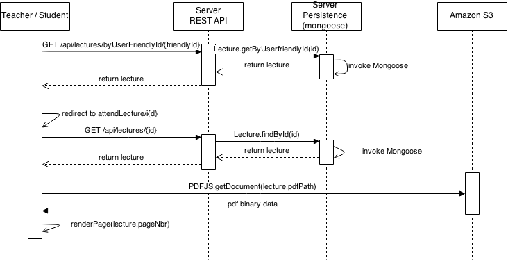
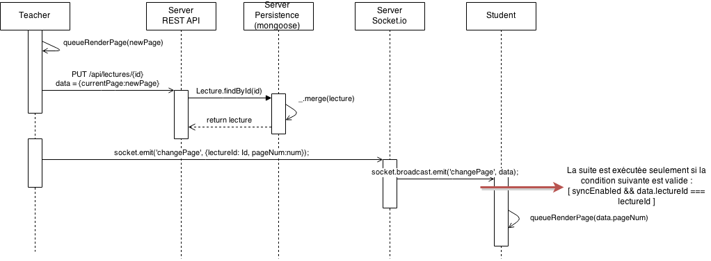

Technical documentation
=========================

This section targets people who wish to know more about how our <a href="http://tweb-project3-jollien-ngo.herokuapp.com/" target="_blank">**Classroom Conference WebApp**</a> works inside, including software developers who wish to contribute to its development, or users who want to investigate a problem with our wepapp in greater depth. (If you are only looking for information on how to download and run the app localy, see the [End-user documentation page](https://github.com/schodaw/TWEB-Project1/blob/master/README.md "End-user documentation page (on Github)") instead.)

---

# Summary

* [**Frameworks and Libraries**](#Frameworks_and_Libraries)
	* [*Scaffolding and Pipelining*](#Scaffolding_and_Pipelining)
		* [Yo](#Yo)
		* [Grunt.js](#Grunt.js)
	* [*Frontend*](#Frontend)
		* [Bower](#Bower)
		* [Bootstrap](#Bootstrap)
		* [Angular.js](#Angular.js)
		* [PDF.js](#PDF.js)
	* [*Backend*](#Backend)		
		* [Jade](#Jade)
		* [Stylus](#Stylus)
		* [NPM](#NPM)
		* [Node.js and Express](#Node.js_and_Express)
		* [Socket.IO](#Socket.IO)
		* [Amazon S3](#Amazon_S3)
		* [MongoDB](#MongoDB)
		* [Mongoose](#Mongoose)
* [**Implementations**](#Implementations)
	* [*Implementation of the slide-show feature*](#Implementation_of_the_slide-show_feature)
		* [Joining a lecture](#Joining_a_lecture)
		* [Slideshow - control system (the "Next" and "Previous" buttons)](#Slideshow_-_control_system)
* [**Issues encountered during the project**](#Issues_encountered_during_the_project)
	* [*User roles*](#User_roles)
	* [*Amazon S3 credentials*](#Amazon_S3_credentials)

------------

# Frameworks and Libraries 

## Scaffolding and Pipelining 

At the beginning, we start our project from scratch and generate an application skeleton. In order to setup a complete, automated, efficient and reliable development workflow, we will use **Yo** and **Grunt**. 

### Yo 

**Yo** is a tool for generating project skeletons (scaffolding), and we use the **Angular.js Full-Stack** generator like framework. 

Runs the generator and sets up a new Angular.js + Express app : 

	yo angular-fullstack twebProject1App

Generates a new API endpoint :

	yo angular-fullstack:endpoint chat
	yo angular-fullstack:endpoint lecture
	yo angular-fullstack:endpoint lectureModel

Generates a new route :

	yo angular-fullstack:route giveLecture
	yo angular-fullstack:route attendLecture

### Grunt.js 

**Grunt.js** is a JavaScript based task runner and using JSON for configuration. It is used to automate repetitive tasks in our development workflow. We use it to automate tasks like compilation, versioning, testing, deploying etc.
To use Grunt, first create a gruntfile.js file where you configure the different tasks that will be performed by Grunt. Then launch the different tasks with command line by giving the name of the task you want to run.

For building in the `dist` folder  : 

	grunt build

For previewing the app on the local machine : 

	grunt serve

Commit and push the resulting build to heroku (must be executed in the /dist folder) :

	grunt buildcontrol:heroku

Extract from `Gruntfile.js` :

	// Define the configuration for all the tasks
	grunt.initConfig({
		// Project settings
		pkg: grunt.file.readJSON('package.json'),
		yeoman: {
		  // configurable paths
		  client: require('./bower.json').appPath || 'client',
		  dist: 'dist'
		},
		express: {
		  options: {
			port: process.env.PORT || 9000
		},
		...
	});

## Frontend 

### Bower 

**Bower** is a tool for managing web dependencies for the front-end : frameworks, libraries, assets and utilities. Bower uses a flat dependency tree, requiring only one version for each package, reducing page load to a minimum. It works by fetching and installing packages, taking care of finding and downloading. Bower keeps track of these packages in a manifest file `bower.json`.

Install packages to the folder `bower_components` and update the file `bower.json`:

	bower install [component-name] --save

or install all packages from the files `bower.json` : 

	bower install

Example of dependencies :

	{
	  "name": "tweb-project1",
	  "version": "0.0.0",
	  "dependencies": {
	    "angular": ">=1.2.*",
	    "json3": "~3.3.1",
	    "es5-shim": "~3.0.1",
	    "jquery": "~1.11.0",
	    "bootstrap": "~3.1.1",
		 ...
	    "angular-socket-io": "~0.6.0",
	    "angular-ui-router": "~0.2.10",
	    "pdfjs-dist": "~1.0.931",	    
	    "aws-sdk-js": "~2.1.2"
	  },
	  "devDependencies": {
	    "angular-mocks": ">=1.2.*",
	    "angular-scenario": ">=1.2.*"
	  }
	}

A version can be :
- semver version : `1.2.3`
- version range : `>=1.2.`, `~2.1.2`

### Bootstrap 

**Bootstrap** is the most popular HTML, CSS and Javascript framework for developing faster and easier front-end web project. It is a free collection of HTML and CSS-based design templates for typography, forms, buttons, navigation and other interface components. 

Using the system of layout grid, Bootstrap scales our web application by resizing differents components according to the percentages of space occupied. It totally supports  responsive web design for laptops, tablets or mobile phones. 

An example of a simple form and a button, wrapped by two columns and a row :
	
	

	  

	    <h1>Join a lecture</h1>
	    
The lecture code is displayed in the upper-right corner of the page displaying a lecture currently given by a teacher

	  

	  

	    <form class="thing-form">
	      

	        <input type="text" placeholder="Type the lecture code given by the teacher" ng-model="lecture.userFriendlyId" class="form-control"/>
	          <button type="submit" ng-click="joinLecture()" class="btn btn-primary">Join</button>
	      

	    </form>
	  

	
		

### Angular.js 

**Angular.js** is an open-source web application framework for client-side model-view-controller architecture which allows to develop single-page applications. 

It works by reading the HTML page, which has embedded into it additional tag attributes. Those attributes are interpreted as directives telling Angular.js to bind input or output parts of the page to a model that is represented by JavaScript variables. The binding is two-ways.

An example of the directive `ng-repeat` and the variable `chat` :

With `$scope`, we can expose data and function to our view :

`giveLecture.controller.js` :

	$scope.chatMessages = [];

    //get chat messages of lecture
    $http.get('/api/lectures/' + $scope.lectureId + '/chats').success(function(chatMessages) {
        $scope.chatMessages = chatMessages;
        //live syncronization of chat messages 
        socket.syncUpdates('chat', $scope.chatMessages, function(event, item, object) {
            $scope.chatMessages = object.filter(function(chat) {return chat.lectureId == $scope.lectureId;});
        });
    });

In the view, we use the **directive** `ng-repeat` and **variable** `chat` to refer to the scope : 

`giveLecture.jade` :

	.row.no-glutter(ng-repeat='chat in chatMessages' ng-init='scrollDown()')
	 hr
	  .col-md-1.col-centered.col1on3 {{chat.time}}
	  .col-md-1.col-centered.col2on3 {{chat.author}}
	  .col-md-1.col-centered.col3on3 {{chat.content}} 
	
With this code, the chat messages are stored in the scope in the variable chatMessages. Angular.js generates a new line for every chat message to display in HTML it's attributes "time", "author" and "content".
The function syncUpdates provided by the scaffolding provides a dynamic update of the chat messages with Socket.IO.

### PDF.js 

**PDF.js** is a JavaScript library intended to render PDF files using the HTML5 Canvas. It relies on the use of promises.

The function `renderParge(pageNumber)` gets page info from document, resize canvas accordingly, and render page. The function `queueRenderPage(pageNumber)` handles the queue of pages rendering. The three functions `onPrevPage()`, `onNextPage()` and `changePage(pageNumber)` allow to change the page

Extract from "attendLectureController.js" :

    var pdfDoc = null,
      pageNum = 1,
      pageRendering = false,
      pageNumPending = null,
      scale = 1,
      canvas = document.getElementById('the-canvas'),
      ctx = canvas.getContext('2d');
	...
	//retreiving the PDF file
	PDFJS.getDocument(lecture.pdfPath).then(function (pdfDoc_) {
		pdfDoc = pdfDoc_;
		//display the number of pages of the PDF
		document.getElementById('page_count').textContent = pdfDoc.numPages;

		// Initial/first page rendering
		renderPage(pageNum);
	});
	...
	function renderPage(num) {
        pageRendering = true;
        // Using promise to fetch the page
        pdfDoc.getPage(num).then(function(page) {
          ...
          var renderTask = page.render(renderContext);

          // Wait for rendering to finish
          renderTask.promise.then(function () {
            pageRendering = false;
            if (pageNumPending !== null) {
              // New page rendering is pending
              renderPage(pageNumPending);
              pageNumPending = null;
            }
          });
        });

        // Update page counters
        document.getElementById('page_num').textContent = num;
    }

## Backend 

### Jade 

**Jade** is a template engine implemented with JavaScript for server side templating in NodeJS, at the request processing time. The client sends
an HTTP request. The server builds a model and injects it into a compiled template. The result is sent back to the client. 

Jade is a templating language for html, so it makes writing html less verbose. It's whitespace sensitive, we can nest tags within other tags just by indenting them. Simple short hands help to reduce typing effort like adding IDs and classes, adding attributes to tags, etc.

Here are some examples of theses advantages in `giveLecture.jade`.

Example of using indent : 

	div
	.container-fluid  
	  .row.no-gutter
	    .col-md-9.col-centered.fill.left

Result in HTML :

	

		

			

				

			

		

	

		
Examples of adding IDs and classes : 

	.col-md-3.col-centered.right

	div#msgWrapper

Result in HTML :

	

	

	
Examples of adding attributes to tags :

	input.form-control(type='text', placeholder='Write a title', ng-model='newLectureModelTitle')

Result in HTML :

	<input type="text" placeholder="Write a title" ng-model="newLectureModelTitle" class="form-control"/>

### Stylus 

**Stylus** is a dynamic stylesheet language, an expressive CSS preprocessor syntax for NodeJS. Compared to CSS, with Stylus, we can omit braces, semi-colons, colons, and we can define functions.

An example from `giveLecture.styl` :

	h3
	    margin-top: 0px
	    margin-bottom: 0px
	    
	#msgWrapper
	    height:550px
	    width:100%
	    overflow-y: scroll
	    overflow-x: hidden
	    
	.col1on3
	    width:25%

### NPM 

NPM is a package manager for Node.js. It manages this framwork's dependencies in the back-end.
The file `package.json` contains the packages that NPM will install when the command `npm install` is issued in the same folder as the file. It this file you specify the packages and their version.

Extract from `package.json`

    "dependencies": {
       "express": "~4.0.0",
       "morgan": "~1.0.0",
       "body-parser": "~1.5.0",
       "method-override": "~1.0.0",
       "serve-favicon": "~2.0.1",
        ...
      }

### Node.js and Express 

Node.js is a platform built on Chrome's JavaScript runtime for easily building fast, scalable network applications. Node.js uses an event-driven, non-blocking I/O model that makes it lightweight and efficient, perfect for data-intensive real-time applications that run across distributed devices.

Node.js is our back-end technology. To ease the creation of our project, a web application, we use Express which is a web framework for Node.js

In the code shown below, just a few lines are enough to initialise a HTTP server running in Node.js with the express framework and expose our web application. As we can see, Express makes it really easy. This code was generated by Yeoman, our scaffolding tool.

Extract from `app.js` in the `server` folder (so on the back-end)

    ...
    var express = require('express');
    ...
    var app = express();
    var server = require('http').createServer(app);
    ...
    require('./config/express')(app);
    ...
    server.listen(config.port, config.ip, function () {
        console.log('Express server listening on %d, in %s mode', config.port, app.get('env'));
    });
    ...
    exports = module.exports = app;

### Socket.IO 

Socket.IO is a library implementing the WebSocket API. WebSocket API and protocol are defined to allow bi-directionnal communication between the HTTP server and client. So with this protocol ther server can push notifications to the client. The advantage of Socket.IO is that it supports several communication channels and mechanisms so depending on the browser capabilities, it can fall back on older techniques (such as long polling).

In the project we use a Bower component called `angular-socket-io` to facilitate the use of Socket.io from an Angular.js application. We then have to inject a Angular.js dependency to `socket` in the code to be able to use it on the client.

The code below show how we use Socket.IO for the slideshow. When the teacher display the next slide a message si sent to the web server which broadcast it to all the students.

Extract from "giveLectureController.js" :
	//on the client, the teacher send an event called "changePage" to the server with Socket.IO
	socket.socket.emit('changePage', {lectureId: $scope.lectureId, pageNum:num});

Extract from "lecture.socket.js" :
	//on the server, we react to the event by broadcasting it to every students
	socket.on('changePage', function(data) {
		socket.broadcast.emit('changePage', data);
	});
	
Extract from "attendLectureController.js" :
	//on the client, the student react to the event by refreshing the pdf display
    socket.socket.on('changePage', function(data) {
        if($scope.syncEnabled && data.lectureId === $scope.lectureId) {
            pageNum = data.pageNum;
			//display pdf page
            queueRenderPage(data.pageNum);
        }
    });
	
### Amazon S3 

To store the PDF files we use Amazon S3. But to prevent it from being filled and keep it free, the PDFs are deleted after 5 days !
However the database of the project is not cleaned the same way and so after 5 days there will still be a link to the deleted file in the database.
To upload files on Amazon S3 we use the `aws-sdk-js` bower package.
The Amazon S3 bucket has been configured to allow CORS access to allow us to retreive the PDF files.
The upload is done in the front end on the client.

Extract from `mainController.js` :

    // Configure The S3 Object
    AWS.config.update({ accessKeyId: $scope.creds.access_key, secretAccessKey: $scope.creds.secret_key });
    AWS.config.region = 'eu-central-1';
    // Configure the Amazon S3 bucket with the bucket address
    var bucket = new AWS.S3({ params: { Bucket: $scope.creds.bucket } });
    ...
	// Upload the PDF on Amazon S3
    var params = { Key: $scope.file.name, ContentType: $scope.file.type, Body: $scope.file, ServerSideEncryption: 'AES256' };
    bucket.putObject(params, function(err, data) {
    ...
    }

After the upload on Amazon S3 is complete, the URL to the PDF is inserted in the database as a LectureModel.

### MongoDB 

### Mongoose 

----------------------------------

# Implementations 

## Implementation of the slide-show feature 

The sequence diagrams in this chapter show simplified invocation chains. For example, the
`socket.on()` method invocations are not visible in the sequence diagram to
provide an easy to read diagram.

### Joining a lecture 

To join a lecture, a user has to enter the "user-friendly" id of the lecture
given by the teacher. A first GET request is done to retreive the _id property
of the lecture generated by mongoose. The user is then redirected on the page to
attend to a lecture with the lecture _id as a query string parameter.

When a user arrives on the pages to give or attend a lecture, a second GET
request is done to retreive the informations of the lecture with the query
string parameter.

The the pdf-file is then loaded. They are stored in an Amazon S3 bucket which
have been configured to accept CORS inducing requests sent by a specific user
that is known by the application.

### Slideshow - control system (the "Next" and "Previous" buttons) 

When the teacher change the displayed slide, the current page number is updated
in the database. This allows the student to join a started lecture and receive
the page number their client must display when getting the informations about
the lecture.

The teacher also sends a message to the server with the `socket.emit()` function
of the socket.io library. Which then broadcast the message to all the students
with the `socket.broadcast.emit()` function. The message contain the new page
number to display and the id of the lecture given by the teacher. The event name
related to the `socket.io` message is `changePage`.

We have to send the lecture id because every students are receiving the messages
and they have to filter them to only react (and display the new slide) to the
ones that concern the lecture they are attending. The students will also ignore
all messages if they have disabled the slide synchronisation.

-------------------------------------

# Issues encountered during the project 

## User roles 

The role of the users (Student or Teacher) give them different rights. For
example, only teachers are allowed to upload a new slide deck and start a
lecture. There is an issue with asynchronous code in the `Auth` module provided by
the scaffolding (angular-fullstack) we use.

The problem is that `currentUser = User.get();` triggers an asynchronous HTTP
call, and that currentUser is not immediately set (it is a non-blocking call).
Since the promise is resolved immediately, clients are lead to believe that the
login process has completed and that all user data is available, whereas it is
in fact still in flight. We fixed this issue by using the provided
`isLoggedInAsync()` function, but the different forms that allow only teachers to
do tasks are still displayed for students even though they are not working for
them (clicking on the buttons will not trigger the action).

## Amazon S3 credentials 

To allow the client to get the PDF files stored on Amazon S3, we have to give
him the user credentials of the Amazon user we created. We first put them in our
code on our Git repository but Amazon forgive us to make the credentials
publicly available for security reasons. To resolve the problem we had to delete
the user credentials, create new ones and only add them in the code published on
heroku.
